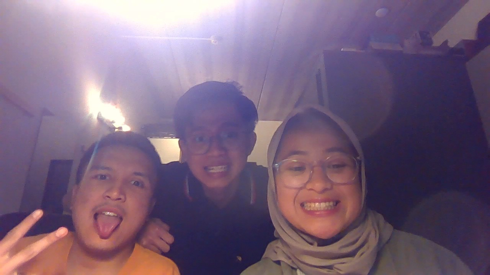

# Prayla Barli 

## Education 
I obtain my Bachelor's degree in [Ocean Engineering program](https://www.ocean.itb.ac.id/) at [Institut Teknologi Bandung](https://itb.ac.id/). 
Currently, I am doing my Master's in [Hydraulic Engineering](https://www.tudelft.nl/citg/over-faculteit/afdelingen/hydraulic-engineering) at [TU Delft](https://www.tudelft.nl/). 

## Research Interest 
I am passionate in the Coastal Engineering field, including data-driven shoreline change projection and mangrove restoration. 